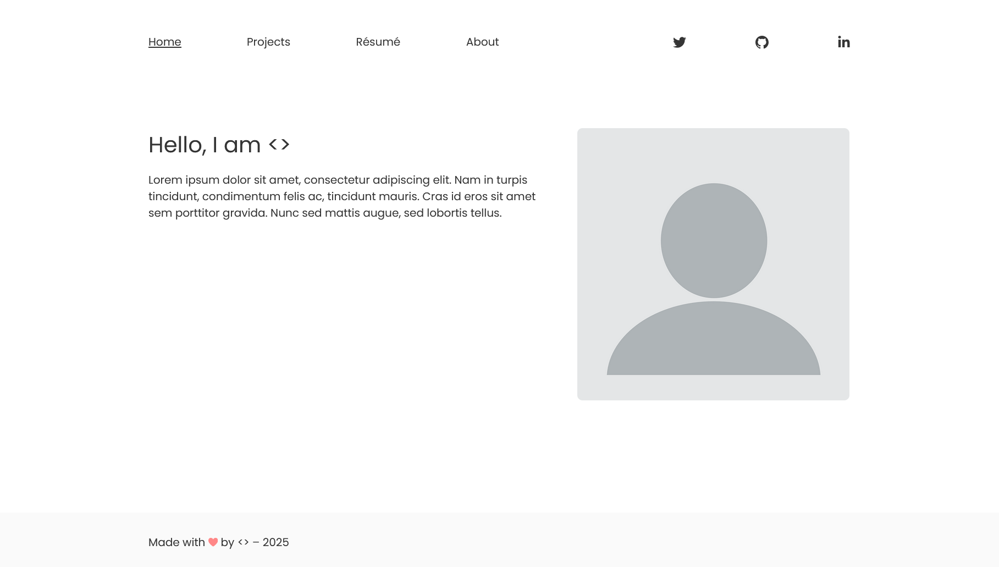

# Clarity Jekyll Theme
**This is a GitHub Pages template recreating the [Clarity Template](https://shikun.io/projects/clarity) by [Shikun Liu](https://shikun.io/) in Jekyll.**
> Note that this project is primarily imitating Clarity's visual layout, and not (yet) its research-oriented content features.



# Getting Started

1. Register a GitHub account if you don't have one and confirm your e-mail (required!)
1. Click the "Use this template" button in the top right.
1. On the "New repository" page, enter your public repository name as "[your GitHub username].github.io", which will also be your website's URL.
1. Set site-wide configuration and add your content.
1. Check status by going to the repository settings, in the "GitHub pages" section

## Running locally

When you are initially working on your website, it is very useful to be able to preview the changes locally before pushing them to GitHub. To work locally you will need to:

1. Clone the repository and made updates as detailed above.

### Using a different IDE
1. Make sure you have ruby-dev, bundler, and nodejs installed
    
    On most Linux distribution and [Windows Subsystem Linux](https://learn.microsoft.com/en-us/windows/wsl/about) the command is:
    ```bash
    sudo apt install ruby-dev ruby-bundler nodejs
    ```
    If you see error `Unable to locate package ruby-bundler`, `Unable to locate package nodejs `, run the following:
    ```bash
    sudo apt update && sudo apt upgrade -y
    ```
    then try run `sudo apt install ruby-dev ruby-bundler nodejs` again.

    On MacOS the commands are:
    ```bash
    brew install ruby
    brew install node
    gem install bundler
    ```
1. Run `bundle install` to install ruby dependencies. If you get errors, delete Gemfile.lock and try again.

    If you see file permission error like `Fetching bundler-2.6.3.gem ERROR:  While executing gem (Gem::FilePermissionError) You don't have write permissions for the /var/lib/gems/3.2.0 directory.` or `Bundler::PermissionError: There was an error while trying to write to /usr/local/bin.`
    Install Gems Locally (Recommended):
    ```bash
    bundle config set --local path 'vendor/bundle'
    ```
    then try run `bundle install` again. If succeeded, you should see a folder called `vendor` and `.bundle`.

1. Run `jekyll serve -l -H localhost` to generate the HTML and serve it from `localhost:4000` the local server will automatically rebuild and refresh the pages on change.
    You may also try `bundle exec jekyll serve -l -H localhost` to ensure jekyll to use specific dependencies on your own local machine.

If you are running on Linux it may be necessary to install some additional dependencies prior to being able to run locally: `sudo apt install build-essential gcc make`
